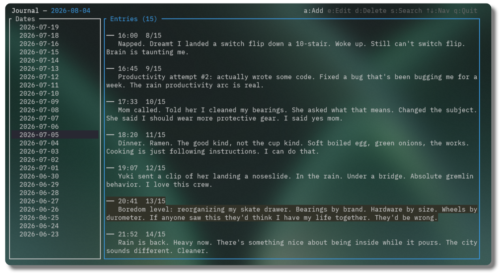

<p align="center">
  
</p>

<p align="center">
  <a href="https://github.com/JanickLntz/jrnl/actions/workflows/ci.yml"></a>
  <a href="https://crates.io/crates/jrnl"></a>
  <a href="LICENSE.md"></a>
</p>

---

**jrnl** is a fast, keyboard-driven journal for the terminal. Add entries from the command line, browse them in a fullscreen TUI, or export summaries for LLM context — everything lives in clean markdown files you own.

## Features

- **CLI quick-entry** — `jrnl -m "Today I learned..."` captures a thought in under a second
- **Fullscreen TUI** — browse dates, scroll through entries, search, edit and delete without leaving the terminal
- **Search** — find entries by keyword across your entire journal
- **Summary export** — dump a date range as markdown (great for paste into ChatGPT, Claude, etc.)
- **Plain markdown storage** — entries are `YYYY/MM/DD.md` files with YAML frontmatter, readable by any editor
- **Cross-platform** — Linux, macOS, Windows

## Installation

### Cargo (recommended)

```bash
cargo install jrnl
```

### Pre-built binaries

Grab the latest binary for your platform from the [Releases](https://github.com/JanickLntz/jrnl/releases) page.

### Build from source

```bash
git clone https://github.com/JanickLntz/jrnl.git
cd jrnl
cargo build --release
# binary at ./target/release/jrnl
```

## Usage

### CLI

```bash
# Quick entry
jrnl -m "Deployed the new API endpoint today"

# With a custom date
jrnl -m "New Year's resolution" -d 2025-01-01

# List most recent entries (default: 10)
jrnl list
jrnl list -n 20

# Search
jrnl search "rust"

# Export last 7 days as markdown (for LLM context)
jrnl summary
jrnl summary --last 30d
jrnl summary --from 2025-06-01 --to 2025-06-30
```

### TUI

Run `jrnl` without arguments to open the interactive interface:

| Key | Action |
|-----|--------|
| `↑` `↓` | Navigate dates / entries |
| `←` `→` | Switch panels |
| `Tab` | Toggle panels |
| `a` | Add a new entry |
| `e` | Edit selected entry |
| `d` | Delete selected entry |
| `s` or `/` | Search |
| `q` or `Ctrl+c` | Quit |

## Storage

Entries live under your system's local data directory as markdown files:

| Platform | Path |
|----------|------|
| Linux | `~/.local/share/jrnl/` |
| macOS | `~/Library/Application Support/com.jrnl.jrnl/` |
| Windows | `C:\Users\<Name>\AppData\Local\jrnl\jrnl\data\` |

Directory structure:

```
├── 2025/
│   ├── 06/
│   │   ├── 15.md
│   │   ├── 16.md
│   │   └── ...
│   └── 07/
│       └── ...
```

Each file contains one or more entries with YAML frontmatter:

```markdown
---
date: "2025-06-15T14:30:00"
---

Finished the Rust refactor. Everything compiles.
```

This means your journal is fully portable — open it in any text editor, back it up with git, or process it with your own scripts.

## License

[MIT](LICENSE.md)
